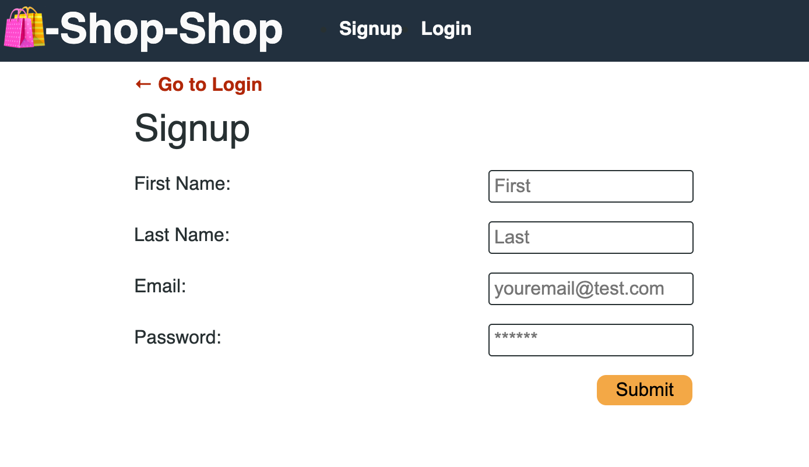
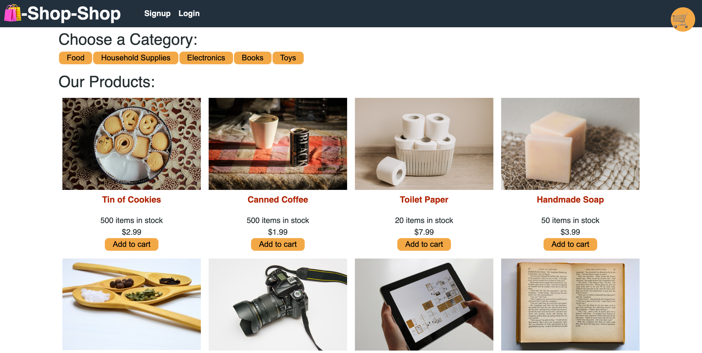
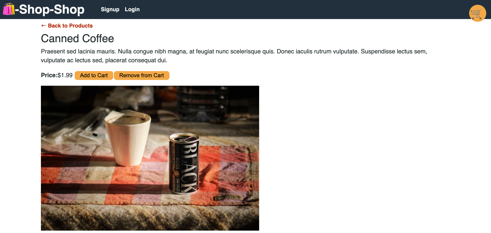
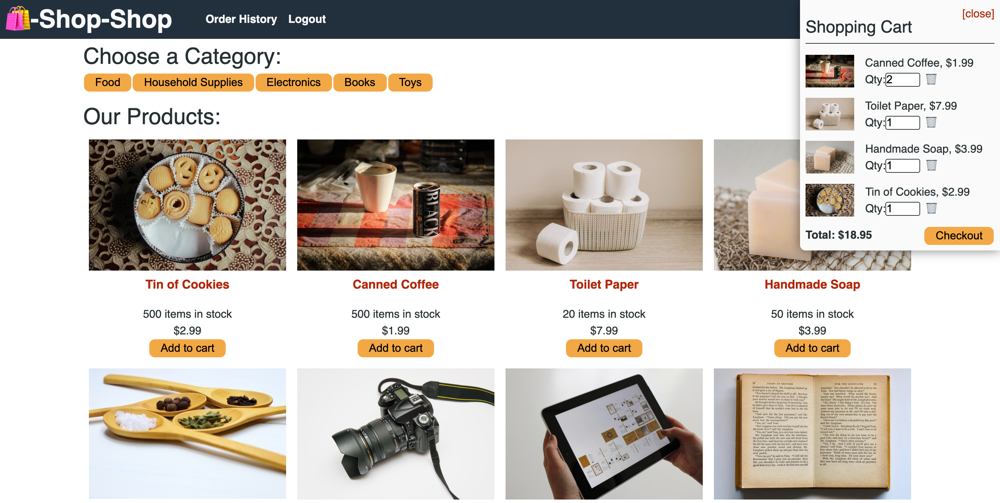
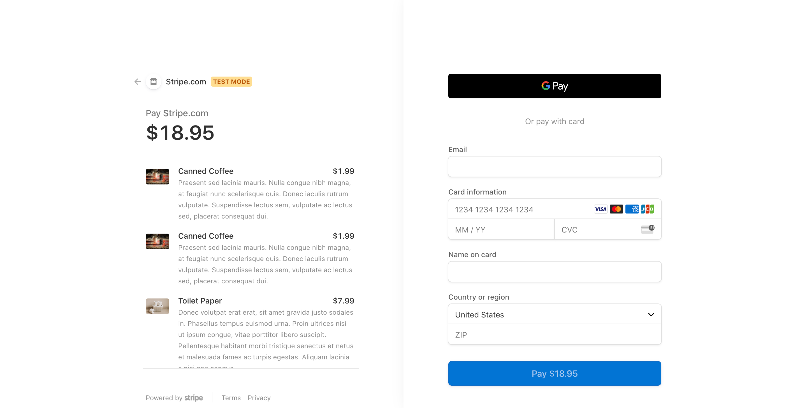
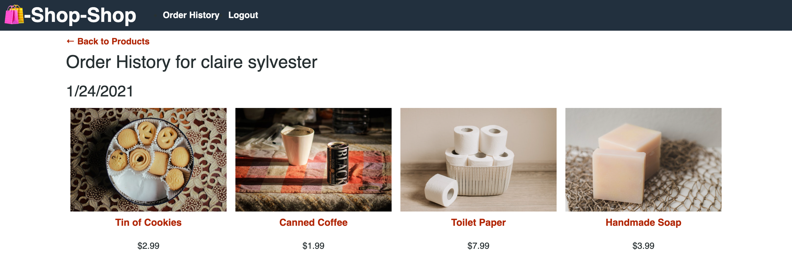

# Shop-Shop

 

## Description
Shop-Shop is an ecommerce MERN application. Users are able to browse items and add them to a cart, which will persist if the website is left. Additionally, users can create an account to keep track of what items they have purchased. The payment processing platform used is Stripe.

Instead of a RESTful API, Shop-Shop utilizes GraphQL paired with Apollo. This is done to save bandwidth and reduce waterfall requests. It also enables clients to request their own unique data specifications. IndexedDB is implemented to create persistent cart data, as users are accustommed to that feature. While Stripe API is the payment processing platform for the checkout process. Shop-Shop initially used React-Context for state management but was refactored to use Redux for its predictability, DRY code, and speed. While JsonWebToken and JWT-Decode enable the safe transmission of user data. The bcrypt hashing function allows us to build a password security platform that scales with computation power and always hashes every user password with a salt. 

## Table of Contents
  - [Usage](#Usage)
  - [Installation](#installation)
  - [Technology Used](#technology-used)
  - [Questions](#questions)
  - [Links](#links)
  - [License](#license)
  
## Usage

#### Signup Form:

#### Application Homepage:

#### Product Page:

#### Shopping Cart:

 #### Stripe Checkout:

 #### User Order History:

 
  
  ## Installation
  Node.js, NPM, and MongoDB must be installed on your computer.  
   Clone the repo:  
      `git clone https://github.com/CFsylvester/shop-shop.git`  
   Navigate to the root directory and run:  
      `npm install`  
   To start the server locally, run the following:  
      `npm start`  
   Navigate to <b>localhost:3001</b> in your browser to open the application locally.

  ## Technology Used

 

 

 
  
 
  
  ## Questions
  Please reach out to me at [clairesylvester@clairecodes.dev](mailto:clairesylvester@clairecodes.dev?subject=[GitHub%shop-shop]%20Source%20Han%20Sans)

  ## Links
  - **[Deployed App](https://shop-shop-mern.herokuapp.com/)**
  - **[GitHub Repo](https://github.com/CFsylvester/shop-shop)**
  - **[My Portfolio](clairecodes.dev)**
  - **[Connect on LinkedIn](https://www.linkedin.com/in/claire-sylvester-386373143/)**
  - **[GitHub profile](https://github.com/CFsylvester)    **

  ## License 
  This application uses the MIT license.  
